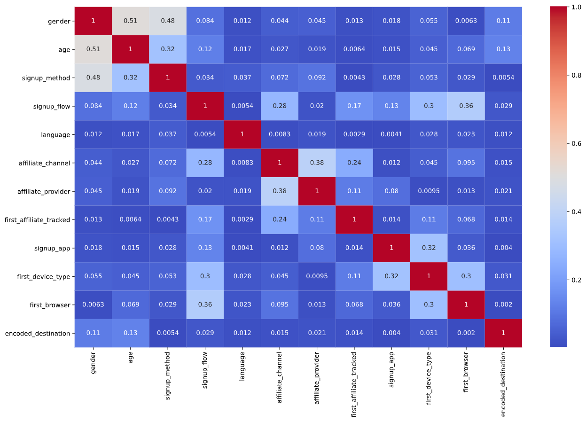

# Destination Prediction

The purpose of the exercise is to predict which country the service user will make their first trip to. This label is contained in the ‘country_destination’ column. This is a multi-class classification problem. Possible values are:
- NDF
- US
- FR
- IT

The proposed solution is divided into:

## 00: Instructions
Problem explanation and evaluation methods.

## 01: Exploratory Analysis

This type of analysis aims to provide an understanding of the data, using numerical and graphical methods, providing an in-depth view for the application of the models and consequently the extraction of knowledge.


The first problem found was the huge unbalance between classes. For solving this, some solutions have been raised, such as downsampling of the most frequent classes, upsampling or synthetic data generation using SMOTE (Synthetic Minority Oversampling Technique) for the less frequent classes.

These techniques, individually or used together, were able to improve the prediction of the less frequent classes (IT and FR), however they presented a worsening in the evaluation metrics (Log Loss and AUC).


Correlation between variables |  Age box plot
:-------------------------:|:-------------------------:
  |  

Another problem found was the existence of many missing values for the "age" and "first_affiliate_tracked" columns.
As "first_affiliate_tracked" is a categorical variable, the solution was to replace the missing values by a 'N/A' string.


In the case of age, it was attempted to determine the missing values by training a linear regression using the other explanatory variables of the model. However, given the low correlation between these variables, the R2 score was extremely low and, at the end, it was decided to replace the missing values by the average of the distribution.

## 02: Pre processing

Here, I created a pipeline divided into 3 steps:

- **Time data feature engineering**

There are two features containing temporal data: "timestamp_first_active" and "date_account_created".

They were used to create a new Boolean variable that indicates whether the user was active on the same day as the account creation.
Then the timestamp was divided into separate columns of year, month, and day.

- **Categorical Features**

Here the missing values are imputed by a new 'N/A' label, then the labels are replaced by numeric values using the Label Encoder of Scikit Learn.

Initially, the approach considered was the creation of dummy variables, but as some features (such as language) have many unique values, this caused many columns to be created, lingering model training without improvement in the results.

The proposed classifier is XGBOOST that is not impaired by the existence of encoded variables in the same feature, since it is done by parallel trees boosting and the tree type models can handle categorical variables.

- **Numerical Features**

Here the missing values are imputed by the mean value of the distribution and the data is normalized.

The "age" feature also contains some impossible values that are handled separately:

1. Values bellow threshold (7 years old) are replaced by the minimum age defined.
2. Values above threshold (115 years old) are in the range 1924 - 2014, it is assumed that the user entered birth year instead of age, and in such cases, age is replaced by the current year (2021) minus the original field value.

## 03: Modeling

This notebook contains the comparison between the performance of the classifiers (XGBoost and Decision Tree) in three different circumstances (or with the combination of them):
- Downsampling of the most frequent classes
- Upsampling of the less frequent classes
- Generation of synthetic data using the SMOTE algorithm for less frequent classes
- Training of the models weighed by the proportion of existing elements in the class

The Max_Depth training hyperparameter that limits the growth of the trees up to the overfitting limit was set using Grid Search.

The comparison of these different settings was used to set the final model based on AUC and Log Loss as recommended by the instructions for the exercise.

## 04: Prediction

In this notebook, the previously created files of the pre-processing pipeline and model binary are used to make the prediction (predict_proba) of the out of time sample (without labels), using the required format:

```
{'NDF': 0, 'US': 1, 'Fr': 2, 'it': 3}
```

The final result is saved in the directory
```
data > predictions.csv
```

# Installation

Install python
```
sudo apt-get update
sudo apt-get install python3.6
```

Install xgboost required binaries:
```
brew install xgboost
```

Create a virtual environment called "venv" and activate it
```
python3 -m venv venv
source venv/bin/activate
```

Install the required packages
```
pip install -r requirements.txt
```

## Usage 

Run the exploratory analysis notebook
```
jupyter notebook <notebook_name>.ipynb
```
